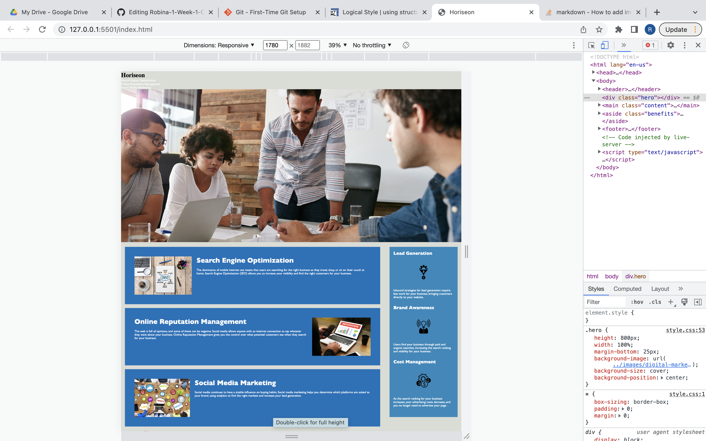

# Robina-1-Week-1-Challenge
# The Horiseon project 
 this project demonstrates the array of regulation html has on the web browser by adhering to proper html formatting. 
 ___
 ___ 
 # Introduction
The project allows users to debug the source code that was causing the website to show poorly in the browser. 
 ___
 # Description  
 I used html to change the block element div tag in the body of the code to the inline element section for each line in the code this resulted in logical structure in the web browser. I then used the alt attribute to implement unique identifiable descriptors for individuals with impairments for better navigation on the browser.  The title tag was updated to reflect a unique and descriptive title, so prospective clients could automatically see the name of the company. 
Alt attributes were applied throughout the entire webpage to the side column for the icons. This gave enough detail allowing the page to be more user friendly for everyone.
It was challenging as a new developer applying the necessary tags, class, and attributes to achieve the request of the ticket, however with testing and frequently inspecting the browser the modifications were made. I added section tags to the html to separate each feature of the Horiseon has to offer. This made the paragraphs asthetically appealing to the reader.
# Set up
Run the code in the bowser by following the url link below
[ website link](http://127.0.0.1:5501/index.html) 
The user should be able to view the image below 
